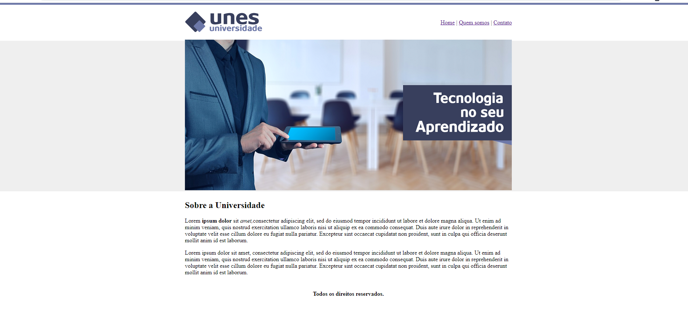
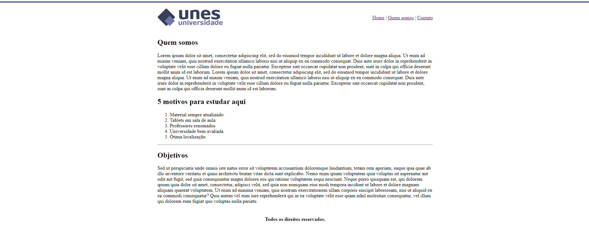
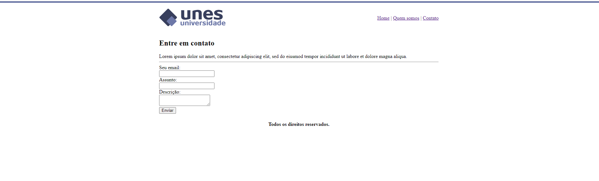

# Universidade UNES
Este projeto consiste na criação de um website para uma universidade fictícia a fim de treinar os conhecimentos em HTML5. Dessa forma, o site todo é feito usando apenas HTML5, sem estilos de CSS.

<h2>O projeto:</h2>

<h3>Início</h3>

<h3>Quem Somos</h3>

<h3>Contato</h3>

<h2>O curso:</h2>

Desenvolvimento Web Completo + 20 projetos - Udemy

<h2>  TECNOLOGIAS</h2>

HTML5

